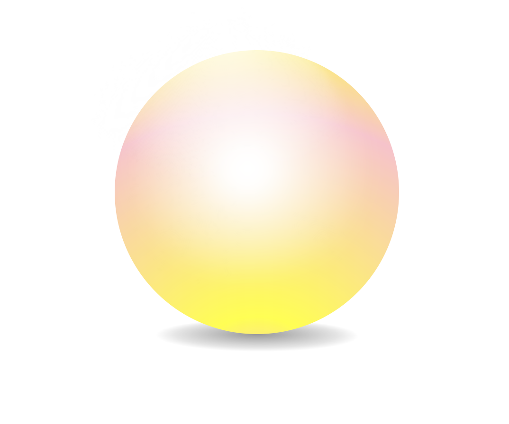

# CSS Exploration

Having not previously made any conscious effort to tackle CSS, exploring the world of possibilities with pure CSS.

#### Getting Started

Circle: 

```
$ git clone https://github.com/CLTPayne/css-exploration.git
$ cd css-exploration
$ open circle.html
```

#### Current State (minus animation)

